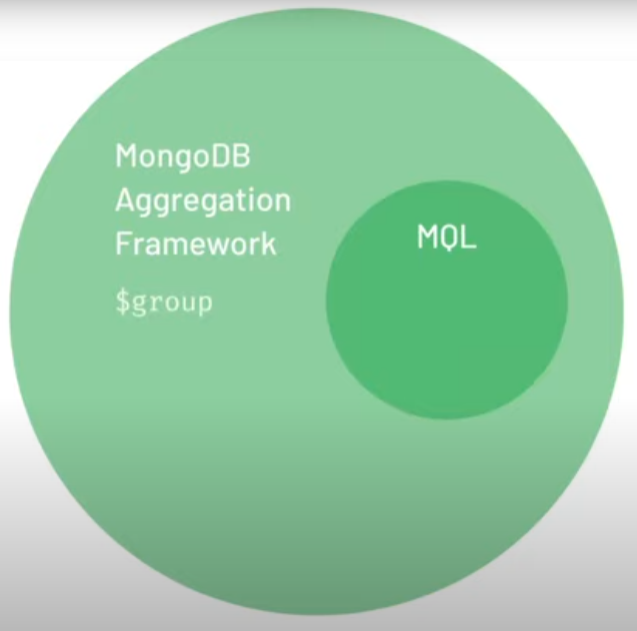

# MongoDB Basics 

## Общие команды 

- Версия mongo

```powershell
mongosh --version
```

## Экспорт и импорт данных

- Bson формат

```powershell
mongodump --uri "mongodb+srv://<your username>:<your password>@<your cluster>.mongodb.net/sample_supplies"

mongorestore --uri "mongodb+srv://<your username>:<your password>@<your cluster>.mongodb.net/sample_supplies"  --drop dump
```

- Json формат

```powershell
mongoexport --uri="mongodb+srv://<your username>:<your password>@<your cluster>.mongodb.net/sample_supplies" --collection=sales --out=sales.json
mongoimport --uri="mongodb+srv://<your username>:<your password>@<your cluster>.mongodb.net/sample_supplies" --drop sales.json
```

## Базовые команды

- Отобразить все БД на сервере

```powershell
show dbs
```

- Переключиться между БД на сервере

```powershell
use sample_training
```

- Отобразить все коллекции на сервере

```powershell
show collections
```

## Базовые команды

- Найти элемент

```javascript
db.#название_коллекции.find({"<поле>": "<значение>"})
```

- Посчитать кол-во элекмнтов в коллекции

```javascript
db.#название_коллекции.find({"<поле>": "<значение>"}).count()
```

- "Красивое" отображение

```javascript
db.#название_коллекции.find({"<поле>": "<значение>"}).pretty()
```

- Поиск одного документа. Чаще необходимо дял того что бы понять структуру документа в коллекции

```javascript
db.#название_коллекции.findOne();
```

## Вставка элемента в коллекцию

- _id не обязателен
- Может быть сгенерирован
- По умолчанию ObjectId
- Может быть любым типом

```javascript
db.#название_коллекции.insert({
      "id" : "10021-2015-ENFO",
      "certificate_number" : 9278806,
      "business_name" : "ATLIXCO DELI GROCERY INC.",
      "date" : "Feb 20 2015",
      "result" : "No Violation Issued",
      "sector" : "Cigarette Retail Dealer - 127",
      "address" : {
              "city" : "RIDGEWOOD",
              "zip" : 11385,
              "street" : "MENAHAN ST",
              "number" : 1712
         }
  })
```

- Множественная вставка в коллекцию

```javascript
db.#название_коллекции.insert([ { "test": 1 }, { "test": 2 }, { "test": 3 } ])
```

## Свойство "ordered"

- "ordered" отвечает за продолжение массовой операции.
- Если оно true (по умолчанию), то после ошибки, оставшиеся данные в команде обработаны не будут
- Если оно false, то после ошибки, данные будут обрабатываться
- В первом случае (если true) будет вставлена только 1-ая запись, на 2-ой произойдет ошибка, 3-я будет проигнорирована
- Во втором случае (если false) будет вставлена 1-ая и 3-я запись,  2-ая будет проигнорирована из-за ошибки

```javascript
db.#название_коллекции.insert([
    { "_id": 1, "test": 1 },
    { "_id": 1, "test": 2 },
    { "_id": 3, "test": 3 }
],
    { "ordered": false })
```

## Команды для обновления одной строки или нескольких

- Увеличить у какждой записи с city==HUDSON поле population на 10 у.е.

```javascript
db.#название_коллекции.updateMany({ "city": "HUDSON" }, { "$inc": { "population": 10 } })
```

- Установить для поля zip==12534 поле population равное 17630.
- Если неправильно указать поле, то будет создано новое поле с указанным значением

```javascript
db.#название_коллекции.updateOne({ "zip": "12534" }, { "$set": { "population": 17630 } })
```

- Добавить элемент в массив

```javascript
db.#название_коллекции.updateOne(
    { "student_id": 250, "class_id": 339 },
    { "$push":
            { "scores":
                    { "type": "extra credit",
                        "score": 100
                    }
            }
    })
```

## Команды для удаления

- Удалить множество документов с test==1

```javascript
db.#название_коллекции.deleteMany({ "test": 1 })
```

- Удалить один документ с test==3

```javascript
db.#название_коллекции.deleteOne({ "test": 3 })
```

- Удалить коллекцию
- Если удалить все коллекции, то БД также удаляется

```javascript
db.#название_коллекции.drop()
```

## Дополнительные модификаторы для операций

- $inc увеличить
- $set установить
- $unset ?
- $eq =
- $ne !=
- $gt >
- $lt <
- $gte >=
- $lte <=
- Синтаксис использования: {<поле>:{$<модификатор>:"<значение>"}}

## Логические операторы

- $and И
- $or ИЛИ
- $nor XOR
- $not отрицание
- Синтаксис использования $and, $or, $nor: {$<модификатор>:[{<поле>:"<значение>"}, {<поле>:"<значение>"}]}
- Синтаксис использования $not: {$<модификатор>:"<значение>"}
- Пример использования:

```javascript
db.#название_коллекции.find(
    { "$and": [
                { "$or" : [
                            { "dst_airport": "KZN" },
                            { "src_airport": "KZN" }
                        ]},
                { "$or" : [
                            { "airplane": "CR2" },
                            { "airplane": "A81" }
                        ]}]})
    .pretty()
```

## Оператор "выражения" $expr

- Позволяет использовать внутри себя операторы сравнения и логические операторы на полях одного документа
- "$" используется для 1) указания оператора 2) указания адреса = разыменование поля (непосредственно ссылка на поле в документе, его значение)
- Синтаксис агрегации: {<оператор>:{<поле>:"<значение>"}}

```javascript
db.#название_коллекции.find(
    {
        "$expr":{
            "$and": [
                {
                    "$gt":[
                        "$tripduration", 1200
                    ]
                },
                {
                    "$eq":[
                        "$end station id", "$start station id"
                    ]
                }
                ]
        }
    })
    .count()
```


## Операторы для работы с массивом

- $push добавить элемент в массив
- $size размер массива
- $all массив должен содержать следующие элементы (перечислить их в [])

```javascript
db.#название_коллекции.find(
    {
        "amenities":{
            "$size": 20,
            "$all": [
                "Internet",
                "Wifi", 
                "Kitchen"
            ]
        }
    })
    .pretty()
```

- $elemMatch проверяет элементы массива на соответствие определенному паттерну {$elemMatch: {<поле>:"<значение>"}}
- При обращении к массиву как {arr:"<значение>"} будет найден массив содержащий этот элемент
- По умолчанию, при обращении к массиву как {arr:["<значение>","<значение>",...]} бедет выполнен поиск на полное соответствие, включая порядок следования элементов

```javascript
db.#название_коллекции.find(
    {
        "class_id": 431
    },
    {
        "scores":{
            "$elemMatch": {
                "score": {
                    "$gt": 85
                }
            }
        }
    })
    .pretty()
```
	

## Проекция

- Синтаксис find({...},{<поле>:<1или 0>})
- "1" - включает поле в результат, "0" - исключает. Нельзя использовать одновременно 1 и 0.
- Исключение: можно использовать _id:0, потому что, по умолчанию, оно всегда отображается.

```javascript
db.#название_коллекции.find(
    {
        "amenities":{
            "$size": 20,
            "$all": [
                "Internet",
                "Wifi",
                "Kitchen",
            ]
        }
        },
    {
        "price": 1,
        "address": 1
    })
    .pretty()
```

## Для запроса поддокументов или элементов массива в Mongo используется "точечная нотация"

- например: {<верхний уровень>.<подобъект/подэлемент>.<какое-то поле>}
- для массивов можно указывать индекс {<верхний уровень>.<0,1,2,3,...>.<какое-то поле>}

## Регулярные выражения

- Оператор для работы с регулярными выражениями: $regex 

```javascript
db.#название_коллекции.find(
    {
        "relationships.0.person.first_name": "Mark",
        "relationships.0.title": {"$regex": "CEO" }
    },
    { "name": 1 })
    .pretty()
```

## MongoDB Aggregation Framework

- Существует язык Агрегаций (MongoDB Aggregation Framework). Он гораздо шире, чем MQL.



- $match - ищет соответсвие у полей документов, подобно find
- $project - определяет какие поля надо выводить, а какие нет 
- $group - группирует даные по заданному критерию, например по полю. Также может агрегировать данные, например находить их кол-во.
- для команды $group поле _id является полем ключа группировку, его необходимо обязательно указывать.

```javascript

db.#название_коллекции.aggregate(
    [
        { "$match": { "amenities": "Wifi" } },
        { "$project": { "price": 1,"address": 1,"_id": 0 }}
    ])
    .pretty()

db.#название_коллекции.aggregate(
    [
        { "$project": { "address": 1, "_id": 0 }},
        { "$group": { "_id": "$address.country" }}
    ])

db.#название_коллекции.aggregate(
    [
        { "$project": { "address": 1, "_id": 0 }},
        { "$group": { "_id": "$address.country","count": { "$sum": 1 } } }
    ])
```

## "Команды курсора": функции sort() и limit()

- cursor - содержит данные уже выбранные из БД
- Функции, которые применяются к cursor, как и .count(), .pretty()
- .sort() - сортирует данные по-возратсанию ("1") или по-убыванию ("-1")
- .limit() - ограничивает выборку дисскретным числом элементов
- Когда .sort() и .limit() используются в одной команде, то mongo ВСЕГДА считает, что сначала идет sort, а уже потом limit

```javascript
db.#название_коллекции.find().sort({ "pop": 1, "city": -1 }).limit(10)
```

# Краткое введение в индексы

- Индексы ускоряют поиск документов в БД
- Индекс составляется по полю документа, но также может быть и составным - несколько полей

```javascript
db.#название_коллекции.createIndex({ "birth year": 1 })

db.#название_коллекции.createIndex({ "start station id": 1, "birth year": 1 })
```

# Моделирование данных

- Важно понимать как правильно представить данные в коллекции в mongo
- Важно: если данные используются совместно, то и хранить их надо вместе, а не разделять на разные коллекции.

# Upsert

- Структура команды .updateOne() или .updateMany() - .update<>({<filter>},{<update>},{<option>})
- upsert воходит в состав поля <option>
- 
```javascript
db.#название_коллекции.updateOne(
    {
        "sensor": r.sensor,
        "date": r.date,
        "valcount": { "$lt": 48 }
    },
    { "$push": {
        "readings": { "v": r.value, "t": r.time } },
        "$inc": { "valcount": 1, "total": r.value }
    },
    { "upsert": true })
```

