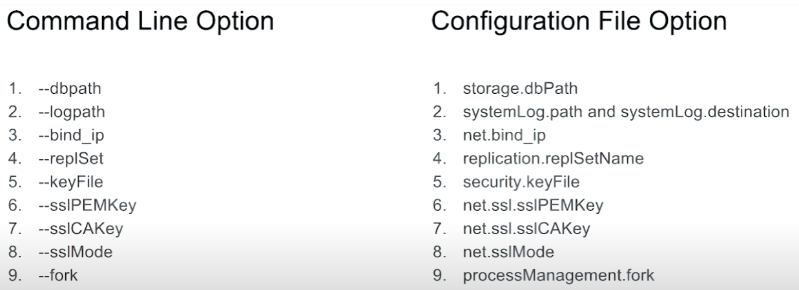
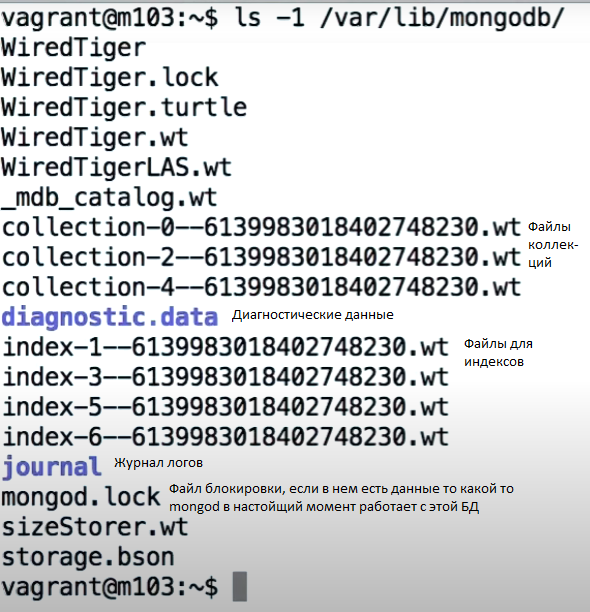
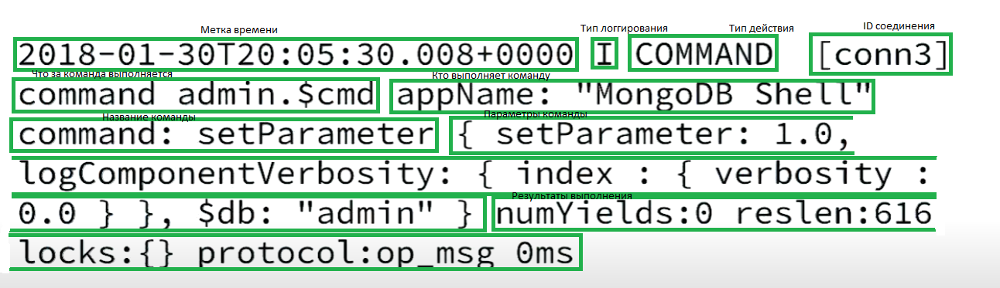

# M103 Basic Cluster Administration 

## Общие понятия

- mongod - демон mongo, который разворачивается на сервере
    - Разворачивается на порту 27017
    - БД хранится в /data/db
    - По-умолчанию доступен только для localhost
    - По-умолчанию аутентификация отключена

- `mongod` - запуск демона
- `mongo` - запуск клиента

- Клиент может отправлять команды на сервер
```javascript
db.createCollection("employees")
```

- Чтобы оставновить демон через зклиент можно вызвать
```javascript
use admin
db.shutdownServer()
exit
```

### Конфигурация mongod
- `mongod --help` - показывает справку
- `mongod --dbpath <directory path>` - задает путь до места где будут храниться файлы БД и логи
- `mongod --port <port number>` - порт, который будет прослушиваться mongo-демоном, по умолчанию 27017
- `mongod --auth` - включать ли авторизацию
- `mongod --bind_ip localhost,123.123.123.123` - развешит ьподключение тольк оуказанным серверам

- Пример командной строки для запуска демона
```powershell
mongod --dbpath /data/db --logpath /data/log/mongod.log --fork --replSet "M103" --keyFile /data/keyfile --bind_ip "127.0.0.1,192.168.103.100" --tlsMode requireTLS --tlsCAFile "/etc/tls/TLSCA.pem" --tlsCertificateKeyFile "/etc/tls/tls.pem"
```
### Соотношение названий параметров в команде и название параметров в конфиг файле



- Пример yamL-файла для установки конфигурации
```yaml
storage:
  dbPath: "/data/db"
systemLog:
  path: "/data/log/mongod.log"
  destination: "file"
replication:
  replSetName: M103
net:
  bindIp: "127.0.0.1,192.168.103.100"
  tls:
    mode: "requireTLS"
    certificateKeyFile: "/etc/tls/tls.pem"
    CAFile: "/etc/tls/TLSCA.pem"
security:
  keyFile: "/data/keyfile"
processManagement:
  fork: true
```
- Чтобы использовать конифгурационный файл необходимо указать его в вызове mongod: `mongod --config "etc/mongod.conf"` или `mongod -f "etc/mongod.conf"`
- `etc/mongod.conf` - стандартное место раземещения файла конфигурации

- Из каких файлов состоит mongo?



## Команды доступные в оболочке клиента MongoDb

- `db.<метод>` - команды обращенные к БД
  - `db.<коллекция>.<метод>` - команды обращенные к конкретной коллекциии
- `rs.<метод>` - команды обращенные к реплика сету
- `sh.<метод>` - команды обращенные к shell (командной строке)

- `db.createUser()`/`db.dropUser()` - создать и удалит ьпользователя в БД
- `db.<collection>.renameCollection()` - переименовать коллекцию
- `db.<collection>.createIndex()` - создать индекс в коллекции
- `db.<collection>.drop()` - удалить коллекцию
- `db.dropDatabase()` - удалить БД
- `db.createCollection()` - создать коллекцию вручную
- `db.serverStatus()` - получить текущий статус БД

- Все команды выше - это обертки над полноценными командами. Ниже представлен синтаксис команды для создания индекса через непосредственный запуск команды:
```javascript
db.runCommand(
    {
      "createIndexes":"<collection_name>",
      "indexes": [
                  {
                      "key":{ "product": 1 },
                    "name": "name_index"
                  }
                  ]
    })
```

- Пример как можно создать индекс с помощью команды обертки:
```javascript
db.<collection>.createIndex(
  { "product": 1 },
  { "name": "name_index" }
)
```

- Выполнить команду не заходя в оболочку можно используя параметр `=-eval`
- `db.setLogLevel(0, "index")` - установить определенный уровень для логгирования (от 0 до 5), чем больше, тем подробнее и детальнее будет лог, и тем больше информации будет выводится


- Структура строки из лог-файла




- Логи можно увидеть используя команды:
  - `tail -f <path-to-log-file>` from the command line
  - `db.adminCommand({ "getLog": "global" })` from the Mongo shell

### Профилировщик
- Есть три уровня: 0 - выключен, 1 включен только для команд, котоыре выполняются более 100ms, 2 включен для всех команд
- `db.getProfilingLevel()` - получить информацию о профилировщике
- `db.setProfilingLevel(1)` - установить уровень у профилировщика 
- `db.setProfilingLevel( 1, { slowms: 0 } )` - установить время выполнения для команды (действует, если выбран 1-ый уровень в профилировщике)

### Создание пользователей
- Пользователи всегда создаютсядл  конкретных БД
- Есть несколько типов авторизайций в mongo
  - SCRAM
  - X.509
  - Прочие корпаративные решения
- SCRAM изначально нет пользоватлей, но при первом подключении с localhost можно создать пользователя. Но это можно сделать тольк оодин раз! Поэтому надо создавать root-пользователя

```javascript
use admin
db.createUser({
  user: "root",
  pwd: "root123",
  roles : [ "root" ]
})
```

```powershell
mongo --username root --password root123 --authenticationDatabase admin
```

- Аутентификация через shell
```mongo admin -u root -p root123```

- Создать пользователя с правами для конкретной БД
```javascript
db.createUser(
    { user: "security_officer",
      pwd: "h3ll0th3r3",
      roles: [ { db: "admin", role: "userAdmin" } ]
    })
```

- Выдать права для пользователя
```javascript
db.grantRolesToUser(
    "dba", [ { db: "playground", role: "dbOwner"  } ] )
```

- Узнать все роли пользователя
```javascript
db.runCommand(
    {
      rolesInfo: { role: "dbOwner", db: "playground" },
      showPrivileges: true
    })
```
- Получить статистику из монги. Она будет выгружаться каждую секунду
```powershell
mongostat --help
mongostat --port 30000
```

- mongodump выгружает данные в формате Bson, дополнительно создавая данные в Json-формате
```powershell
mongodump --help
mongodump --port 30000 --db applicationData --collection products
ls dump/applicationData/
cat dump/applicationData/products.metadata.json
```

- mongorestore загружает данные в формате Bson
```powershell
mongorestore --drop --port 30000 dump/
```

- mongoexport выгружает данные в Json формате
```powershell
mongoexport --help
mongoexport --port 30000 --db applicationData --collection products
mongoexport --port 30000 --db applicationData --collection products -o products.json
```

- mongoimport загружает данные в Json-формате
```powershell
mongoimport --port 30000 products.json
```

# Replica Set

## Настройка файла конфигурации:

- В конфиге обязательно указывается следующее:
- Серверная аутентификация неявно включает клиентскую аутентификацию `security.authorization: enabled`

```config
net:
  port: 27011
security:
  keyFile: /var/mongodb/pki/m103-keyfile
replication:
  replSetName: m103-example
 ```

- Запуска всех 3-х узлов, инициализируем набор реплик (replica set) и можем добавлять узлы

```javascript
rs.initiate()
rs.add("m103:27012")
rs.add("m103:27013")
```

- Узнать статус реплики в наборе реплик можно комнадой:
```javascript
rs.status()
```

- Проверка, кто сейчас является primary
```javascript
rs.isMaster()
```

- Принудительно инициализировать смену primary узла
```javascript
rs.stepDown()
```

- Получить обсущий статус о всем реплика сете
```javascript
rs.status()
```

- Не такой подробный вариант вывода статуса о реплика сете в отличии от `rs.status()`
```javascript
rs.isMaster()
```

- Раздел реплика сета при вызове его от db. Содержит одно экста поле rbid - кол-во откатов на этом узле.
```javascript
db.serverStatus()['repl']
```

- Команда для получения данный об оплоге. Выводит самую раннюю и самую последную дату команд, которые есть в пологе. Данные выводятся для текущей mongod.
```javascript
rs.printReplicationInfo()
```

- БД local является системной бд и содержит системные коллекции. Почти все из них содержат разного рода конфигурация.
- Наиболее интересна коллекция oplog.rs. Она хранит набор команд за опредленный промежуток времени, которые были выполнены (изменяли данные) в текущем реплика сете.
- После выполнения команды primary узлом, команда записывается в oplog.rs и другие узлы реплика сета (secondary) считывают эту информацию
- Все команды в oplog.rs являются идемпотентными - повторное их применение дает один и тот же результат.
- Коллекция создается после добавления в реплика сет нового узла
- Коллекция занимает 5% от всего отъема БД.

#### Работа с конфигураций на горячую

- Удалить узел из реплика сета (дополнительно убедиться, что узел был удален)
```javascript
rs.remove("m103:28000")
rs.isMaster()
```

- Чтобы перезаписать конфиг, например 1) лишить узел права голоса, 2) сделать его скрытым 3) понизит ьему приоритет, чтобы он не мог стать primary, для этого нужно сохранить конфиг отдельно, перезаписать интересующие нас узлы и сохранить его с помощью команды `rs.reconfig(cfg)`
```javascript
cfg = rs.conf()
cfg.members[3].votes = 0
cfg.members[3].hidden = true
cfg.members[3].priority = 0
rs.reconfig(cfg)
```

- Разрешаем чтени с secondary узла
```javascript
rs.slaveOk()
```

# Sharding

- Дл яшардированного кластера нам нужен
  - mongos - оно управляет/маршрутизирует запросы к шардированному кластеру
  - csrs - это обычный процесс mongod реплика сет, который хранит конфигурацию для шардов

- Как запустить csrs? Нужно добавить в конфиг следующие строки конфигурации. Остальное как у обычной БД
```yaml
sharding:
    clusterRole: configsvr
```

- Как запустить mongos? Нужно добавить в конфиг следующие строки конфигурации. 
```yaml
sharding:
  configDB: m103-csrs/192.168.103.100:26001,192.168.103.100:26002,192.168.103.100:26003
```

- Проверить статус шардированного кластера
```javascript
sh.status()
```

- Как запустить mongod? Нужно добавить в конфиг следующие строки конфигурации.
```yaml
sharding:
  clusterRole: shardsvr
```

- Добавить узел в шардированный кластер
```javascript
sh.addShard("m103-repl/192.168.103.100:27012")
```

- В mongos есть несколько полезных коллекций:
```javascript
use config

db.databases.find().pretty()
db.collections.find().pretty()
db.shards.find().pretty()
db.chunks.find().pretty()
db.mongos.find().pretty()
```

- Включить шардинг для БД, а затем для конретной коллекции
```javascript
sh.enableSharding("m103")
sh.shardCollection( "m103.products", { "sku": 1 } )
```

- Изменить размер chunk-ов
```javascript
db.settings.save({_id: "chunksize", value: 2})
```

- Запустить\остановить балансировку
```javascript
sh.startBalancer(timeout, interval)
sh.stopBalancer(timeout, interval)
```

-Включить\выключить балансировщик
```javascript
sh.setBalancerState(boolean)
```