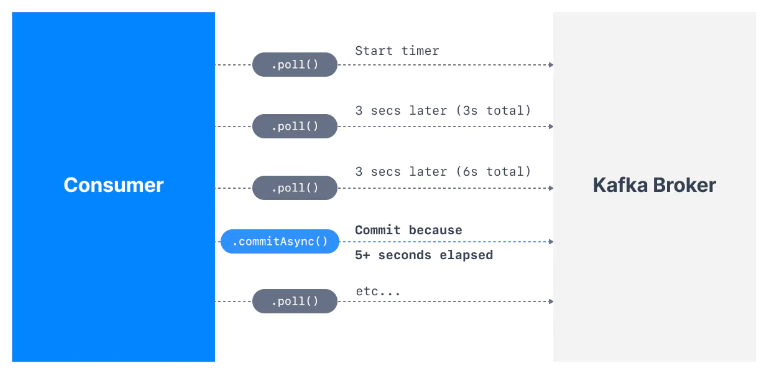
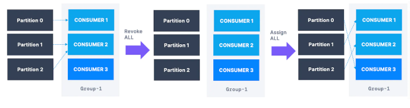

## Утилита kafka-topics

```powershell
kafka-topics.sh --bootstrap-server localhost:9092 --topic first_topic --create --partitions 3 --replication-factor 1
```

- Команда позволяет создавать топики
- Аргумент `--bootstrap-server` используется для более новой версии kafka, для старой использовать `--zookeper`
- Коэфицент репликации не выставлять больше, чем количесво брокеров
- Не стоит устанавливать чересчур большое кол-во партиций - 3 оптимально для старта
- Чтобы посмотреть все топики можно использовать команду:

```powershell
kafka-topics.sh --bootstrap-server localhost:9092 --list
```

## Утилита kafka-console-producer

```powershell
kafka-console-producer.sh --bootstrap-server localhost:9092 --topic first_topic
```

- Позволяет продьюсить сообщения
- Обязательно указываем сервер и название топика
- После запуска утилиты поступает приглашение к вводу сообщения
- По умолчанию, если мы попытаемся писать в топик, который не существует, kafka создаст новый топик. Это можно отключить используя конфиг-файл
- Можно включить/выключить сжатие `--compression-codec`
- Можно передавать дополнительные настройки `--producer-property`
- Kafka может выбирать партицию за счет ключа сообщения. Для того, чтобы установить ключ необходимо добавить следующие свойства: `parse.key` и `key.separator`

```powershell
kafka-console-producer.sh --bootstrap-server localhost:9092 --topic first_topic --property parse.key=true --property key.separator=:
```

## Утилита kafka-console-consumer

```powershell
kafka-console-consumer.sh --bootstrap-server localhost:9092 --topic first_topic
```

- Позволяе тпотреблять сообщения из топика kafka
- По умолчанию начинает читать сообщения с момента запуска. Опция `--from-beginning` позволяет начать читать с самого начала топика.
- По умолчанию информация о партиции и топике не отображается, например, информация об offset или ключе партиционирования
- Порядок сообщений гарантируется только на уровне партиции
- Можно читать несколько топиков одновременно
- Если не указана консьюмер группа, она создается автоматически
- Свойство `--consumer-property` позволяет передавать дополнительные свойства для консьюмера
- Свойство `--group` позволяет задать группу для потребителя
- Можно определить сколько сообщений необходимо прочитать, используя свйоство `--max-messages`
- Можно определеить из какой конкретно партиции хочется прочитать сообщение, используя свойство `--partition`
- С помощью следующей команды можно:

```powershell
kafka-console-consumer.sh --bootstrap-server localhost:9092 --topic first_topic --formatter kafka.tools.DefaultMessageFormatter --property print.timestamp=true --property print.key=true --property print.value=true --from-beginning
```

- `--formatter kafka.tools.DefaultMessageFormatter` позволяет задать форматтер по умолчанию и отформатировать  с помощью настроек:
  - `--property print.timestamp=true` - вывести время создания сообщения
  - `--property print.key=true` - ключ сообщения
  - `--property print.value=true` - значение ключа
  - `--property print.partition=true` - вывести номер партиции
  - `--property print.offset=true` - вывести offset для сообщения
  - `--property key.separator="-"` - установить разделитель для key-value

- Информация о потребителе можно получить указав свойство `--describe`

## Утилита kafka-consumer-groups

- Позволяет управлять группами потребителей
- Нельзя выполнять настройку группы, пока ее члены активны
- Что можно делать с помозью данной команды:

1. Поменять offset/сбросить offset

- Проверить что все потребители остановлены
```powershell
kafka-consumer-groups.sh --bootstrap-server localhost:9092 --describe --group my-first-application
```

- Сброс смещений к самым ранним - `--to-earliest`
```powershell
kafka-consumer-groups.sh --bootstrap-server localhost:9092 --group my-first-application --reset-offsets --to-earliest --execute --topic first_topic
```

- Сдвиг смещений на N назад - `--shift-by -N`
```powershell
kafka-consumer-groups.sh --bootstrap-server localhost:9092 --group my-first-application --reset-offsets --shift-by -2 --execute --topic first_topic
```

- Группы можно сбрасыть используя метки времени, используя свойство: `--by-duration`
- Можно выполнить команду без ее фактического испольнения, используя свойство `--dry-run`
- Все дополнительные опции, которые позволяют изменять offset: `--to-datetime, --by-period, --to-earliest, --to-latest, --shift-by, --from-file, --to-current`

- Полный список все потребительней и их состояние можно получить сл. командой:

```powershell
kafka-consumer-groups.sh --bootstrap-server localhost:9092 --list --state
```

- Используя опцию `--delete` можно удалить группу
- Можно удалять смещения для поределенного топика `--delete-offsets --group my-first-application --topic first_topic`

## Утилита kafka-topics

- Позволяет переопределять свойства конфигурации уже после создания топика
- Пример: можно переопределить количество брокеров, которые реплицируют данные топика:

```powershell
kafka-configs.sh --bootstrap-server localhost:9092 --alter --entity-type topics --entity-name configured-topic --add-config min.insync.replicas=2
```

- `--entity-type` - задает тип сущности (topics)
- `--entity-name` - задает имя изменяемой сущности (configured-topic)
- `--add-config` - добавляет/изменяет значение свойства в конфигурации сущности (min.insync.replicas=2)
- Вместо `--add-config` можно использовать `--delete-config`, что удалить свойство

## Как kafka хранит данные

- Kafka хранит данные партиций (сегменты) в виде файлов в файловой системе. Как только размер файла достигает 1Гб или данные в файле хранятся больше 1 недели, то в таком случае сегмент закрывается и создается новый файл.
- Сегмент можно удалить, когда полностью закрыт
- Настроить размер можно через свойство: log.segment.bytes, а время хранения через свойство: log.segment.ms.
- Kafka поддерживает два вида индекса: по offset-у и по метке времени.

## Дополнительные возможности

- С помощью `log.retention.bytes` и `log.retention.ms` можно задать, сколько времени будут хранится сегменты в файловой системы. `log.retention.bytes` устаналивает ограничение по памяти, по умолчанию не задано. `log.retention.ms` устанавливает ограничение по времени, по умолчанию 1 неделя. Префикс `log.` означает, что настройка относится к брокеру. Если убрать префикс, то можно настраивать отдельный топик.

- С помощью свойства acks можно устанавливать сколько брокеров должны подверждать получения сообщения
  - 0 - никто не подтверждает
  - 1 - подтверждает только лидер
  - N - подтверждает N брокеров, задается свойством `min.insync.replicas`
  - all - подтверждают все


- У Kafka есть ограничение по разему сообщения - это 1Мб. Это можно с помощью свойства `max.message.bytes` на уровне топика. На уровне броке не рекомендует изменять размер сообщения. Также при смене размера сообщения нужно изменить настройку у броке для репликации больших сообщений - `replica.fetch.max.bytes=10485880`, а также для потребителей таких сообщений - `max.partition.fetch.bytes` и производителя - `max.request.size`.


- При попытке отпарвить в Kafka сообщения может возникнуть два вида ошибок: исправимые ошибки, например, исключение `NotEnoughReplicasException` или ошибка, неподлежащая исправлению, например, `INVALID_CONFIG`.
- В Kafka по умолчанию есть система повторных попыток обработки сообщений. Она настраивается с помощью `retries` - кол-во повторных обработок события (в Kafka<2.0 = 0, в более свежих версия это MAX_INT, т.е. 2147483647). Также повторные запросы ограничены по времени таймаутом `delivery.timeout.ms`.
- Также производитель имеет таймаут между повторными попытками обработать сообщение, оно задается `retry.backoff.ms
  ` и по умолчанию 100мс
- С помощью `max.in.flight.requests.per.connection` можно задать кол-во одновременных сообщений в обработке. По умолчанию это кол-во равно 5. Но в такой ситуации возможны гонки между сообщениями (тот случай когда нельзя записать сообщение с первого раза и оно вынуждено повторно обработаться). Это тпараметр важен, когда мы хотим включить идемпотентность на уровне Kafka (`idempotence=true`).
- С Kafka>3.0 по умолчанию включено`enable.idempotence=true` и `acks=all`. Идемпотентность не позволяет обработать одно и тоже сообщение дважды за счет добавлениея к сообщению уникального идентификатора `PID`


- Производители не отправляют данные моментально. Они накапливают некоторый пакет, а посел уже отправляют его. Это имеет повышенную эфективность при сжатии сообщений, т.к. в таком случае сжимается весь пакет. Но также это экономит кол-во сетевых подключений!
- Важно понимать, кто отвечает за сжатие данных производитель данных или брокер kafka. При повторной настройке сжатое сообщение может быть распаковано и сжато уже с использованием сжатия брокера.


- Пакетная обаботка контролируется двумя параметрами `linger.ms` и `batch.size`. `linger.ms` - это время до отправки пакета, оыбчно выставлено как 0, т.е. отправить немедленно. Вводя некоторую задержку мы можем дат ьвремя чтобы набрать некоторый пакет данных, который эфективно сжимается и отправляется по сети -> увеличивается пропускная способность системы. Но этот пакет все равно будет ограничен `batch.size` - размер пакета, 16Кб по умолчанию.


- Есть два подхода к разделению сообщений по партициям при наличи/отсутсвии ключа:
  - Когда сообщения размещаются равномерно по всем партициям - раунд-робин
  - Когда сообщения "слепляются" и отправляются на один брокер, а следующий пакет на другой брокер.


- Можно настроить буфер для сообщений с помощью свойства `buffer.memory`, по умолчанию 32Мб. Эт оможет помочь в случае, когда ндо хранить больше информации на брокере в процессе обработки сообщений. Когда место для хранения заканчивается, то метод send для производителя блокируется.


- Потребители сообщений могут реализовывать разные стратегии обработки сообщений:
  - At Most Once (обработка не более одного раза) - после считывания сообщения, оно отмечается как прочитанное, и при ошибке в обработке оно теряется.
  - At Least Once (обработка по крайней мере один раз) - после считывания сообщения, оно отмечается как прочитанное, и при ошибке в обработке оно может быть обработанно повторно. В этой ситуации важно понимать о идемпотентности операций обработки таких сообщений.
  - Exactly once (обработка только один раз) - Может быть достигнута при работе через API ? с использованием транзакций ?


- По умолчанию свойство `enable.auto.commit=true` включено и фиксирует смещения автоматически с некоторой частотой, регулируемой конфигурацией `auto.commit.interval.ms`. При мер работы на картинке:




- Потребитель в основном потоке общается с брокереом посредством poll-командыи параллельно посылает heartbeats-сигналы координатору группы, тем самым говоря, что потребитель жив. heartbeats-сигналы отправляются с частотой указанной в `heartbeat.interval.ms` (3сек по умолчанию). Если потребитель не будет отправлять такие сигналы то спустя `session.timeout.ms` (Kafka>3.0 45 секунд, Kafka<3.0: 10 секунд) координатор посчитает, что потребитель отключился (мерт) и перебалансирует партиции между потребителями.
- Потребители периодически опрашивают брокеров, используя этот poll-метод. Если два запроса разделены более, чем `max.poll.interval.ms` (5 минут по умолчанию), то потребитель будет отключен от группы.
- `max.poll.records` определяет кол-во записей при одном poll-запросе.
- `fetch.min.bytes` (1 байт по умолчанию) задает  минимальное кол-во байт, которые потребитель хочет считать за один раз. `fetch.max.bytes` (55Мб по умолчанию) задает верхнюю границу. Если брокер не может предоставить необходимый объем, то потребитель будет ждать `fetch.max.wait.ms` (500мс по умолчанию).


- Потребителя можно настроить на чтение с ближайшего брокера, который может и не быть лидером.


- Для потребителей существует несколько стратегий при перебалансировке:
  - Все потребители теряют свои партиции, координатор распределяет партиции для всех потребителей. Из-за этого партиции могут достатся новым потребителям и не вернутся к старым.



  - Постепенная перебалансировка - некоторые партиции отключаются от старых потребителей и перетекают к новым потребителям. При этом старые потребители сохраняют большинство обрабатываемых партиций.


- Можно указать `group.instance.id`, что это делает потребителя статическим: он фикисруется за определнной партицией. У него будет `session.timeout.ms` времени, чтобы вернуть партицию при ее потере. Иначе они будут переназначены, не вызывая перебалансировки. Это полезно, когда потребители поддерживают локальное состояние и кэш.
