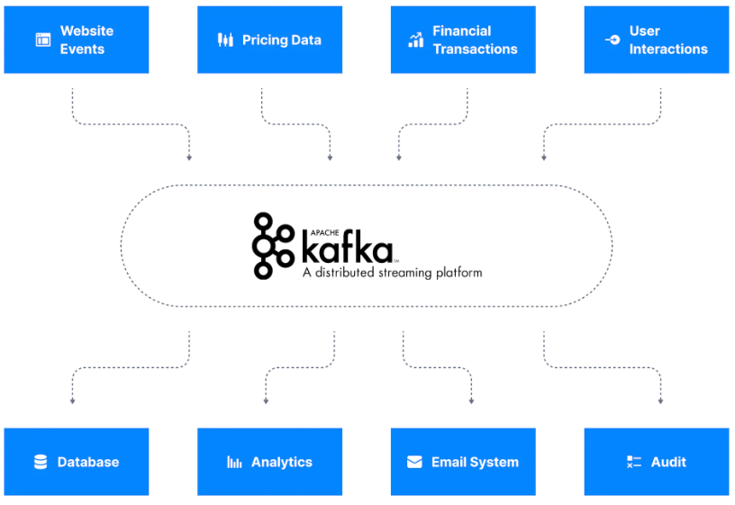
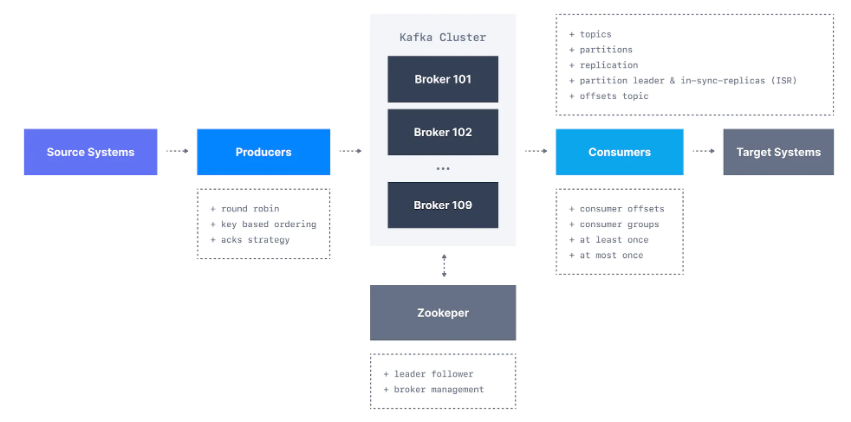
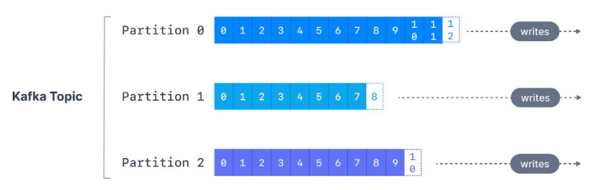
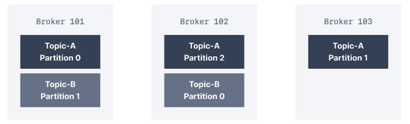
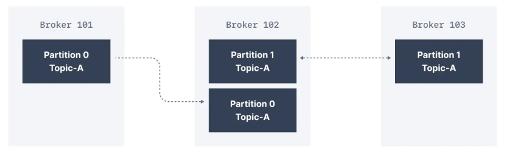

# Kafka

- Kafka - инструмент для потоковой обработки данных.

- Когда использовать:
  - В системах обмена сообщениями
  - Отслеживание пользовательсткой активности
  - Трекинг показателей других приложений, сервисов
  - Интеграция с другими технологиями
  - Хранилище событий

- Когда не использовать:
    - В качестве proxy
    - В качестве БД с индексами
    - В качестве блокчейна
    - В качестве рабочий очереди

> Kafka построена на топиках, а не очередях. Очереди предназначены для масштабирования и позволяют удалять сообщения после обработки. В Kafka данные не удаляются после обработки, а потребители ограничены количеством топиков.



## Экосистема Kafka

Producers - серсисы, которые производят сообщеняи в топики Kafka

Consumers - сервисы, которые потребляют сообщения из топиков Kafka

Topics - потоковые очереди событий

Kafka Cluster - совокупность сервисов, которые обеспечивают работоспособность Kafka, позволяя ей реализовывать потокую обработку данных

Brokers - сервисы, которые обрабатывают входящий поток сообщений. Обычно располагаются на разных серверах, распределяют нагрузку

Zookeeper - БД для хранения конфигурации сервисов Kafka и настроек Topics



### Kafka Topics

- Топики регистрируются по названию
- Сообщения в топиках могут иметь любую структуру
- Последовательность сообщений образует поток данных


- Даные в топики поступают только из **Producers**
- Данные из топиков можно получить только с помощью **Consumers**
- По умолчанию данные в топике храняться **неделю** (Можно настроить)

- Топики разделяются на партиции (разделы). Нумерация партиций начинается с **0**
- **Партиции иммутабельны** <=> Сообщения внутри партиций изменять нельзя
- **Смещение** - это целочисленное значение, которое Kafka добавляет к каждому сообщению по мере его записи в раздел.
- Каждое сообщение в данном разделе имеет уникальное смещение.
- Удаление сообщений никак не влияет на смещение
- Смещение всегда увеличивается



### Kafka Producers

- Партиции для сообщений определяются исходя из значения хэша ключа
- Если ключ = null, то сообщения равномерно распределяются по партициям
- Структура сообщения:
  - Ключ - является идентификатором, по которому определяется партиция. Может быть пустым
  - Значение (сообщение) - само сообщение = полезная нагрузка. Может быть пустым, может быть сжато. Храниться в бинарном виде
  - Тип сжатия - установленный тип сжатия или его отсутствие (none), например, gzip
  - Заголовки (headers) - дополнительные метаданные
  - Партиция (partition) + смещение (offset) - однозначная идентификация сообщения в кафке это топик+партиция+смещение
  - Метка времени

#### хэширование ключей

- Ключи хэшируются используя алгоритм murmur2. По формуле
```javascript
targetPartition = Math.abs(Utils.murmur2(keyBytes)) % (numPartitions - 1)
```

### Kafka Consumers

- Консьюмеры вчегда читают сообщения от меньшего смещения к большему.
- Консьюмеры взаимодействуют с брокерами по моделе pull: они сами запрашивают данные когда им это нужно

### Kafka Consumer Groups and Consumer Offsets

- Консьюмеры могут быть объединены в группу. Для это нужно задать `group.id`.
- Консьюмеры взаимодействую с **координатором группы** и **координатором консьюмера**. Партиция может принадлежать только одному консьюмеру. А консьюмер может иметь несколько партиций.

### Kafka Brokers

- Это отдельный сервер, на котором работает специальная программа, отвечающая за распредделение сообщений
- Брокеры могут объединяться в кластер. В кластере может быть от одного брокера и до бесконечности.
- Между всеми брокерами распределяют партиции всех топиков. Это сделано для распределения нагрузки между серверами.



- При подключении к любому брокеры, мы получаем информацию обо всем кластере. Это осуществляется чере зспециальные метаданные.
- В строке подключения желательно указывать более одного адреса брокера.

### Kafka Topic Replication

- Степень репликации задается для каждого топика отдельно
- При репликации, сообщения одной и той же партиции записываются разными брокерами.
- Степень репликации 1 означается, что репликация отсутствует. Предпочтительнее устанавливать степень репликации 3.



- Сервер, на котором хранится определенная партиция, может быть назвачен лидером для этой партиции. Другие  сервера в наборе реплик с этой партицией будут простыми синхронизированными репликами (ISR).
- Существует параметр - `acks`. Он определяет алгоритм подтверждения записи сообщения на брокер. По умолчанию до версии 3.0 параметр равнялся 1, т.е. для успешной записи нужно было подтверждение только 1 брокера. С версии 3.0 по умолчанию параметр равен "all", т.е. все брокеры у которых есть заданная партиция для сообщения должны подтвердить запись сообщения. Установка параметра в 0 говорит о том, что подтверждать запись не нужно.
- По умолчанию чтение всегда идет с лидера.

### Zookeeper

- Необходим для версий до 3.0. Кафка версии 3.0 может работать без Zookeeper. С версии 4.0 Zookeeper не нужен.
- Необходим для отвлеживания состояния кластера брокеров, его членов и лидеров для партиций пр ирепликации.
- Zookeeper нужен для:
  - Отслеживает какие брокеры являются чатью кластера
  - Определяет лидера среди брокеров и проводит выборы нового лидера при необходимости
  - Хранит конфигурации для топиков
  - Хранит права доступа
  - Отвечает за уведовления при падении брокера и других событиях

### KRaft Mode

- KRaft это попытака отказаться от использования Zookeeper
- Zookeeper дает следующие ограничения:
  - Кластеры Kafka поддерживают только ограниченное количество разделов (до 200 000)
  - Когда брокер Kafka присоединяется к кластеру или покидает его, должно произойти большое количество выборов лидера, что может перегрузить Zookeeper и временно замедлить работу кластера
  - Настройка кластеров Kafka сложна и зависит от другого настраиваемого компонента
  - Метаданные кластера Kafka иногда не синхронизированы с Zookeeper
  - Безопасность Zookeeper отстает от безопасности Kafka

- Без Zookeeper в Kafka наблюдаются следующие преимущества:
  - Возможность масштабирования до миллионов разделов, упрощение обслуживания и настройки
  - Улучшена стабильность, упрощен мониторинг, поддержка и администрирование
  - Один процесс для запуска Kafka
  - Единая модель безопасности для всей системы
  - Более быстрое завершение работы контроллера и время восстановления
