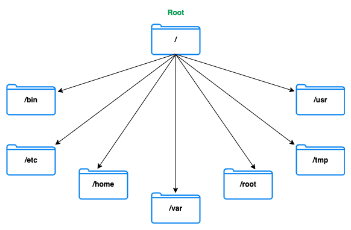

# Linux

## Структура каталогов

- Древовидная структура
- Структура начинается с корневого каталога - root

1. /ets
- Здесь содержатся файлы конфигурации

2. /home
- Здесь содержатся данные пользователей = личные данные

3. /var
- Здесь содержатся разные изменяемые файлы

## Типы пользоватлей

- Есть три типа пользователей - root, regular и service

### `sudo`
- `sudo` расшифровывается как "superuser do"
- С его помощью можно запускать программы от имени суперпользователя при этом оставаясь по своей учетной записью
- Все действия под sudo логгируются!

# Общие команды

- `mkdir  [ modifiers ]  <name of the directory>` - создать каталог, "-p" - рекурсивно создает родительские каталоги
- `rm  [ options ] [ directory | file ]` - удаление файлов и каталогов "-rf" - рекурсивно удалит вложенные каталоги и файлы
- `ls` - список каталогов и файлов в текущей директории, "-la" - полная информация и скрытые директории и файлы
- `cd  <directory>` - переход по директориям
- `cat <name of the file>` - вывод содержимого на дисплей

# Управление процессами 

- `ps -ef  |  grep mongo ps -ef  |  grep mongod ps -ef  |  grep mongos` - команда для проверки того, какие экземпляры mongo, mongod и mongos запущены в системе
- `kill  <pid>` - завершение процесса с указанным pid
- `killall mongod` - завершение всех процессов `mongod`

