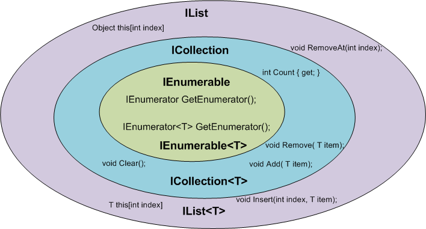

# C# IEnumerable vs List and Array

Для начала надо понимать, какие есть интерфейсы, что они делают. Какие классы и какие интейрфейсы реализуют. В чем различие.

Очень наглядная картинка.



Какие имеем интерфесы:

| # | Тип | Что понимаю под ним | Особенности |
|---|-----|---------------------|-------------|
| 1 | IEnumerable | Буквально то, что можно **перечислить**. То есть можно лишь итерироваться по каким то элементам вперед | MoveNext, Current |
| 2 | ICollection : IEnumerable | Дословно - это некоторая **коллекция**. Коллекции могут разными, но базово дают возможность к CRUD операциям с элементами внутри нее. Появляется возможность получить размер коллекции и установить признак изменяемости(IsReadOnly) | Add, Remove, Count, IsReadOnly |
| 3 | IList : ICollection | "Коллекция, которая обрела порядок." Появилась возможность обращаться к данным по индексу, а также выполнять сортировку | \[index\], Sort  |
| 4 | IReadOnlyCollection : IEnumerable | Неизменяемая коллекция, доступен только перечислитель и размер |  |
| 5 | IReadOnlyList : IReadOnlyCollection | Неизменяемая коллекция с опредленным порядком следования элементов. Доступено обращение по индексу |  |

Все классические структуры данных реализуют интерфейс ICollection и IReadOnlyCollection. List реализует IList и IReadOnlyList.

Что из этого имеем?

- Используя IEnumerable, мы даем доступ только для чтения, а List - нет.
- Структуры данных реализуют IEnumerable, но по факту представляет коллекцию в памяти.

Пример:

```c#
static void Main()
{
  var names = new List<string> {"sam", "alexia", "simon", "sumanth", "tony", "sam", "amr", "mark", "drew"};
  var moreThanFiveLetters = names.Where(w => w.Length > 5);
  names[0] = "benjamin";

  foreach (var name in moreThanFiveLetters)
  {
      Console.WriteLine(name);
  }
}
```

- Объект IEnumerable имеют метод для получения следующего элемента в коллекции. Ему не нужно, чтобы вся коллекция была в памяти. Объект не знает, сколько в нем элементов. Поэтому, например, когда мы вызываем foreach, мы просто продолжаем получать следующий элемент, пока они не закончатся.


- Выражения LINQ возвращают перечисление, и по умолчанию выражение выполняется, когда вы выполняете итерацию по нему с помощью foreach, но можно заставить его выполнить итерацию раньше, используя .ToList() или .ToArray()
- Если использовать .ToList() или .ToArray(), то компилятор сразу же преобразует результаты в заданную структуру
- Используя IEnumerable, мы даем компилятору возможность отложить работу на потом, и возможно, выполнить некоторую оптимизацию до непосредственного выполнения.

Если начать рассуждать о том, стоит ли всегда указывать IEnumerable, то однозначно не стоит. Я считаю, что тип должен трактоваться доменной логикой.

НО! Я и не согласен, что надо использовать конкретно заданный тип, например, List или Array. Это препятствует расширяемости домена. Лучше использовать IEnumerable/ICollection. Если мы хотим показать, что мы можем добавлять и удалять элементы, то тогда используем ICollection. Если мы хотим показать иммутабельность, то лучше использовать один из вариантов ReadOnly<>.

# Ответы на вопросы от Димы Р.

1. Что ты в итоге решил принимать в качестве параметров? Отдельно в случае внутреннего метода реализации или в публичных интерфейсах API.

- Если это метод класса, не часть интейрфейса, то использовать IEnumerable, т.к. при любой необходимости разработчик может изменить это.
- Если это метод интейрфеса, т.е. контракта, то тут следует исходить из места использования контракта и доменной модели. Важно ответить на вопрос что будет передаваться и с какой целью. Внутри доменов использовал по необходимости, отдавая предпочтение интерфейсу IEnumerable. В контрактах для API, которые в виде библиотек, также старался использовать интейрфесы IEnumerable/ICollection/IReadOnlyCollection, но уже с пониманием, где мы используем библиотеку.

2. Что ты в итоге решил возвращать в качестве результата? Отдельно в случае внутреннего метода реализации или в публичных интерфейсах API.

- Внутренний метод класса - IEnumerable/ICollection, т.к. есть 100% контроль за изменением. По умолчанию всегда IEnumerable.
- Внешний метод (метод интерфейса, внутренний контракт с другими класса домена) - IEnumerable/ICollection по ситуации, исходя из того для чего нужны эти данные внутри класса/вне класса. По умолчанию всегда IEnumerable. IReadOnlyCollection - если надо показать иммутабельность. HashSet - показать уникальность.
- API (внешний контракт через библиотеку) - зависит от того, где будет использоваться экспортируемая библиотека. Однозначно не стал бы делать строгий контракт по типу List/Array. Делал бы IEnumerable с оговоркой, что тот кто использует api должен понимать, что он хочет с этими данными делать.
- API (внешний контракт через http) - вопрос к используемому сериализатору, если он умеет работать IEnumable, то здорово. Если не умеет, то тогда используем более жесткий контракт, либо явно приводим к List/Array.

Отмечу здесь важные мысленные замечания:
- Как часто мы получаем IEnumerable и нам нужно добавить/удалить элементы из него? - В большинстве случаев мы делаем с ним LINQ-операции результатом которых всегда является IEnumerable. Исключение операции, когда мы разделяем последовательность данных на новые куски.
- В большиснтве случаев мы придерживаемся иммутабельности на уровне данных. Мы вызываем .Select() и порождаем новые объекты, новую последовательсность, при этом старые данные/последовательности уже могут быть и не нужны.
- При работе внутри класса/внутри домена всегда есть возможность изменить внутренний контракт при необходимости.


3. Удобно ли свободный тип, возвращенный из метода, тут же начинать в коде превращать снова в массивы и списки для работы, чтобы не получать сотни ворнингов?

- Зависит от требований, целей, задач используемого кода.
- Если заранее не известно как будет работать новый код с новыми данными, то лучше оставлять максимально обощенный интерфес - IEnumerable/ICollection. Тот кто будет работать с данными сам решит, что с ними делать. Если уже понятно для чего и как что-то будет использовать, то по ситуации.
   
4. Можешь ли ты полагаться на идеальную реализацию закрытого от тебя кода, что повторных итераций там не произойдет? Или же ты не сможешь этому доверять и несмотря на свободный интерфейс будешь "на всякий случай" туда кастовать и передавать массив? Как ты поступишь в случае работы с какой-то нашей библиотекой и в случае с публичной из нагета, ранее тебе неизвестной.

- Нельзя никому не доверять.
- Лично я бы доверял своим бибилиотекам, больше чем с nuget.
- НО! все равно не стал бы всегда пересобирать структуру, если мне не требуется. Это больше наводит на мысль, что тот кто программирует метод/класс не понимает, для чего он собирается его использовать.

5. Как ты поступишь с точки зрения метрик. Ведь из-за отложенного выполнения иногда тебе придется кастовать объект здесь и сейчас перед возвращением значения из метода.

- Обычно мы не снимаем метрики со всех хендлеров.
- У нас нет каких-то вычислительных хендлеров, поэтому зачастую мы снимаем метрики с точек получения данных, а это API mongo/redis и т.д., следовательно всегда имеет место записимь данных в память.
- Сейчас когда мы работаем с API, мы работаем с ним асинхронно и трекаем ег очерез прометеус с помощью Castle. Там мы всегда вызываем await для task. Что будет, если этот await возвращает IEnumerable? Он вернет перечисление данных на сервере БД? Также есть IAsyncEnumerable, использумый в наших Http Api. Что будет в случае вызова await для него?
- Резюме: есть много нюансов, которые можно рассмотреть. Необходимо понимание работы наших сборщиков метрик. Также нужна необходимость в понимании какие метрики собирать, для чего, что мы хотим по ним увидеться. Однозначного ответа на этот вопрос нет, отдельная тема для обсуждания.

6. Что ты в итоге решил использовать в публичных свойствах классов? Отдельно в случае внутреннего метода реализации или в публичных интерфейсах API.
   - Выше ответил.
7. Что ты считашь более важным: невозможность клиенту вызвать .Clear() по ошибке (злоумышленно по-прежнему можно), либо гарантированную защиту от повторного выполнения кода и неправильного сбора метрик по ошибке?
   - Не смог быстро представить ситуацию. Это точно не супер-мега-крайний кейс?
8. Если ответы будут разными для разных случаев, то считаешь ли ты оправданным так усложнять стиль кода правилами?

- Отсутствие правил = бездуманое написание кода?
- Я не предлагаю жестких правил, но хочу показать, что надо думать о ресурсах, даже если они всегда в изобилии.
   
9. \* Что если вместо общих понятий List<string> использовать более доменные, например ProductCollection, который работает с структурами Product, состоящими из string?
    - Если применять такой подход повсеместно, то следует выработать опредленные правила. Я бы предложил делать как сущности, так и коллекции этих сущностей. Например, сделать структуру Product, потом на ее основе сделать ProductCollection, и т.д.
    - Если не получается применять такой формат, то лучше на таком этапе не вносить таких усложнений. Это будет выглядеть выглядит немного странно, и добавит излишнюю сложность.
    - Отдельный вопрос: как можно это пересечь с DDD и не будет ли конфликтов? Думаю - можно.

# Список литературы

(1) https://medium.com/@ben.k.muller/c-ienumerable-vs-list-and-array-9f099f157f4f

Статья (1) ссылается на интересные статьи:
(1.1) http://twistedoakstudios.com/blog/Post7694_achieving-exponential-slowdown-by-enumerating-twice
(1.2) https://stackoverflow.com/questions/3628425/ienumerable-vs-list-what-to-use-how-do-they-work/3628462#3628462
(1.3) https://www.claudiobernasconi.ch/2013/07/22/when-to-use-ienumerable-icollection-ilist-and-list/

Интересное обсуждение на reddit:
(2) https://www.reddit.com/r/csharp/comments/ubihmb/ienumerable_vs_list/

Статья от microsoft:
(3) https://learn.microsoft.com/en-us/dotnet/standard/design-guidelines/guidelines-for-collections?redirectedfrom=MSDN
(4) https://josipmisko.com/posts/c-sharp-ienumerable-vs-list